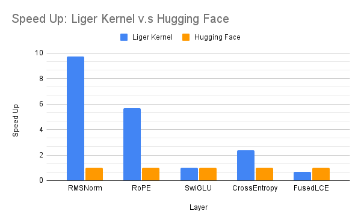
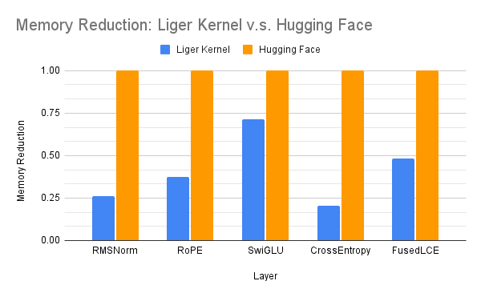
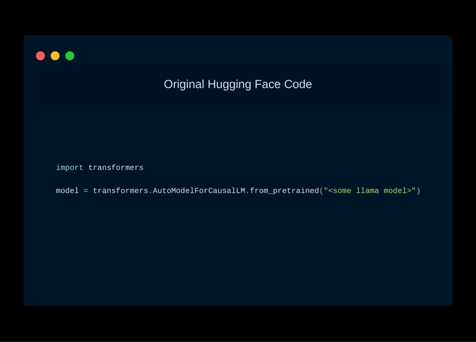
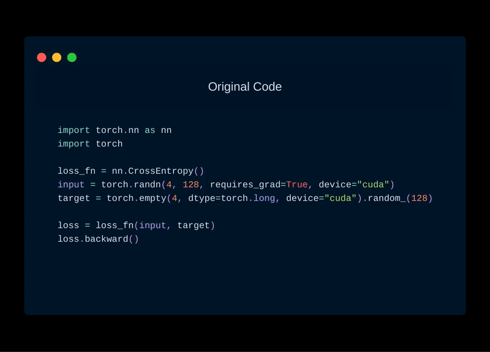

# Liger Kernel

Liger Kernel is the collection of Triton-native kernels for LLM Training. It is designed to be performant, correct, and light-weight.

## Overview


| Speed Up                 | Memory Reduction        |
|--------------------------|-------------------------|
|  |  |

> **Note:**
> 
> 1. Benchmark conditions: LLaMA 3-8B, Batch Size = 4, Sequence Length = 2048, Data Type = bf16, Full Pass (Forward + Backward).
>
> 2. **Fused Linear Cross Entropy Loss** trades time for memory by not materializing full logits, and it is recommended to use it when memory is the bottleneck.


| Patch existing HF model               |  Compose your own model       |
|--------------------------|-------------------------|
|  |  |


## Features

- Forward + Backward
- Hugging Face model compatible. Easily patch model to speed up with 1 line
- Robust unit and convergence tests for kernels
- Compatible with multi GPUs (PyTorch FSDP)
- Compatible with `torch.compile`


## Installation


- dependencies
   - torch >= `2.1.2`
   - triton >= `2.3.0`
   - transformers >= `4.40.1`

```bash
$ pip install liger-kernel 
```

## Usage

1. Patch existing Hugging Face models


```python
from liger_kernel.transformers import apply_liger_kernel_to_llama
from transformers import Trainer

apply_liger_kernel_to_llama() 
model = transformers.AutoModelForCausalLM.from_pretrained("<some llama model>")
```

| **Model**   | **API**                                                      | **Supported Operations**                                                |
|-------------|--------------------------------------------------------------|-------------------------------------------------------------------------|
| LLaMA (2 & 3) | `liger_kernel.transformers.apply_liger_kernel_to_llama`   | RoPE, RMSNorm, SwiGLU, CrossEntropyLoss, FusedLinearCrossEntropy        |
| Mistral     | `liger_kernel.transformers.apply_liger_kernel_to_mistral`  | RoPE, RMSNorm, SwiGLU, CrossEntropyLoss, FusedLinearCrossEntropy        |
| Mixtral     | `liger_kernel.transformers.apply_liger_kernel_to_mixtral`  | RoPE, RMSNorm, SwiGLU, CrossEntropyLoss, FusedLinearCrossEntropy        |

2. Compose your own model

For example, use `LigerFusedLinearCrossEntropyLoss` with `torch.nn.Linear` model

```python
from liger_kernel.transformers import LigerFusedLinearCrossEntropyLoss
import torch.nn as nn
import torch

model = nn.Linear(128, 256).to("cuda")
loss_fn = LigerFusedLinearCrossEntropyLoss()

input = torch.randn(4, 128, requires_grad=True, device="cuda")
target = torch.empty(4, dtype=torch.long, device="cuda").random_(256)

loss = loss_fn(model.weight, input, target)
loss.backward()
```

| **Kernels**                | **API**                                                     | **Description** | **Benchmark (A100) **                                           |
|----------------------------|-------------------------------------------------------------|-----------------|--------------------------------------------------------|
| RMSNorm                    | `liger_kernel.transformers.LigerRMSNorm`                    | TBA            | [time](./benchmark/rms_norm_speed/) / [memory](./benchmark/rms_norm_memory/)                   |
| RoPE                       | `liger_kernel.transformers.liger_rotary_pos_emb`            | TBA            | [time](./benchmark/rope_speed/) / [memory](./benchmark/rope_memory/)                        |
| SwiGLU                     | `liger_kernel.transformers.LigerSwiGLUMLP`                  | TBA            | [time](./benchmark/swiglu_speed/) / [memory](./benchmark/swiglu_memory/)                      |
| CrossEntropy               | `liger_kernel.transformers.LigerCrossEntropyLoss`           | This liger Cross Entropy loss computes both loss and the gradient in the forward path with inplace replacement of input to reduce the peak memory (avoid the materialization of both input logits and gradient) thus reducing the peak memory. We only consider hard label + mean reduction for now. Please refer to https://pytorch.org/docs/stable/generated/torch.nn.CrossEntropyLoss.html for the math.            | [time](./benchmark/cross_entropy_speed/) / [memory](./benchmark/cross_entropy_memory/)               |
| FusedLinearCrossEntropy    | `liger_kernel.transformers.LigerFusedLinearCrossEntropyLoss`| This Liger Cross Entropy loss further improves upon the basic Liger Cross Entropy kernel by reducing peak memory usage through fusion of the model's final output head layer with the CE loss, and chunking the input for block-wise loss and gradient calculation. The same strategy of computing both loss and gradient in the forward path with inplace replacement of input is used here.            | [time](./benchmark/fused_linear_cross_entropy_speed/) / [memory](./benchmark/fused_linear_cross_entropy_memory/)  |

## Structure

1. Source code

- `ops/`: Core Triton operations implementation
- `transformers/`: PyTorch `nn.Module` on top of Triton operations complying with `transformers` API 

2. Tests

- `transformers/`: Correctness tests for the triton-based layers
- `convergence/`: Patch Hugging Face models with all kernels, run X iterations, and compare the weights layer by layer, logits, and loss.


3. Benchmark

- `benchmark/`: Execution time and memory benchmark versus Hugging Face layers.

## Roadmap

## Contributing

## Acknowledgements


## License